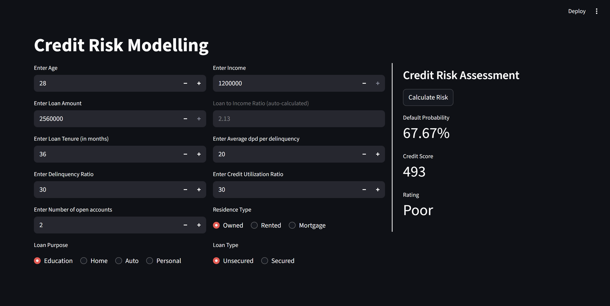
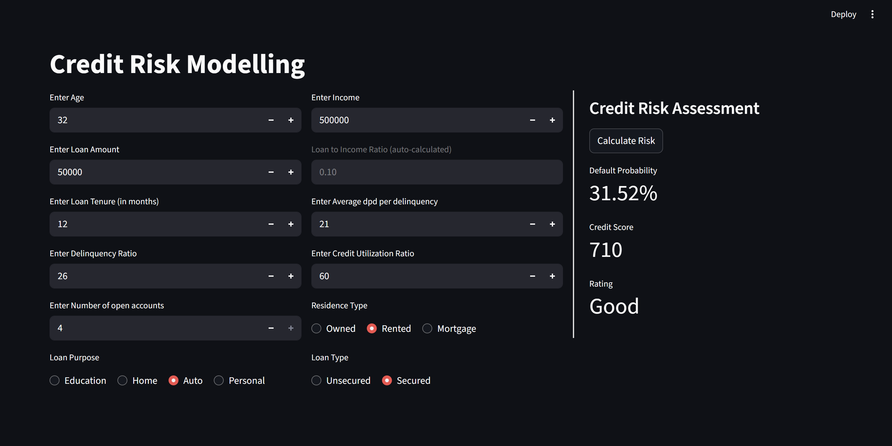
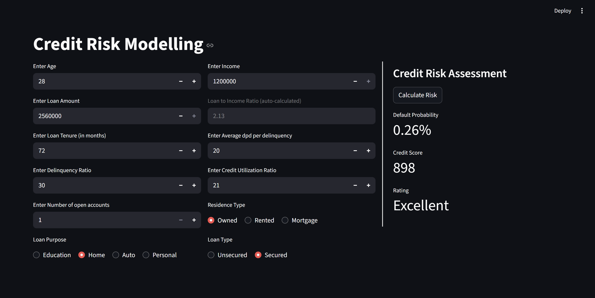

# Credit Risk Model

A machine learning project that predicts the likelihood of a loan applicant defaulting, and translates that into a credit score and rating.

## Live App

[Launch App](https://ml-project-credit-risk-model-azwasxdsvjbrqwtreerte.streamlit.app/)

## Screenshots







## What it does

Given applicant and loan details, the model outputs:

- **Default Probability** — likelihood the applicant will default
- **Credit Score** — scaled from 300 to 900
- **Rating** — Poor / Average / Good / Excellent

## Project Structure

```
ml-project-credit-risk-model/
├── credit_risk_model.ipynb   # ML pipeline: data prep, training, evaluation
├── streamlit-app/
│   ├── main.py               # Streamlit web app
│   ├── prediction_helper.py  # Inference logic
│   ├── requirements.txt      # Dependencies
│   └── artifacts/
│       └── model_data.joblib # Trained model bundle
└── dataset/                  # Raw CSVs (not tracked in git)
    ├── customers.csv
    ├── loans.csv
    └── bureau_data.csv
```

## ML Pipeline

The notebook (`credit_risk_model.ipynb`) covers the full training pipeline:

1. **Data** — merges 3 datasets (customers, loans, bureau) on customer ID (~50,000 records)
2. **Feature engineering** — `loan_to_income`, `delinquency_ratio`, `avg_dpd_per_delinquency`
3. **Preprocessing** — MinMaxScaler, VIF-based multicollinearity removal, Information Value (IV/WOE) feature selection
4. **Encoding** — one-hot encoding for categorical features
5. **Class imbalance** — handled with SMOTE
6. **Model selection** — evaluated Logistic Regression, Random Forest, XGBoost; tuned with Optuna
7. **Final model** — Logistic Regression (C=1.845, solver=saga), ~93% accuracy

The trained model is exported as `artifacts/model_data.joblib` containing the model, scaler, feature list, and columns to scale.

## Input Features

| Feature | Description |
|---|---|
| Age | Applicant age |
| Income | Annual income |
| Loan Amount | Requested loan amount |
| Loan to Income Ratio | Auto-calculated from above |
| Loan Tenure | Loan duration in months |
| Avg DPD per Delinquency | Average days past due per delinquent event |
| Delinquency Ratio | Ratio of delinquent months to total loan months |
| Credit Utilization Ratio | % of available credit in use |
| Number of Open Accounts | Active credit accounts |
| Residence Type | Owned / Rented / Mortgage |
| Loan Purpose | Education / Home / Auto / Personal |
| Loan Type | Secured / Unsecured |

## Running the App

```bash
cd streamlit-app
pip install -r requirements.txt
streamlit run main.py
```

## Dependencies

```
streamlit==1.48.1
scikit-learn==1.6.1
xgboost==3.0.2
pandas==2.2.3
numpy==2.2.4
joblib==1.5.0
```
